# Reverse Engineering

## Description
I wrote a readME document about this specific application. I have never seen it before and figured it would be good practice to describe all the files of an application. 

## Directory Tree/Table of Contents
------
* Config  
    * config.json
* Models  
    * example.js  
    * index.js  
    * schema.sql  
* public
    * js 
        * index.js
    * styles  
        * styles.css
* routes  
    * apiRoutes.js  
    * htmlRoutes.js
* test
    * canary.test.js
* views
    * layouts
        * main.handlebars
    * 404.handlebars
    * example.handlebars
    * index.handlebars
* .eslintignore
* .eslintrc.json
* .gitignore
* .travis.yml
* package.json
* server.js

## Config -> config.json
-----

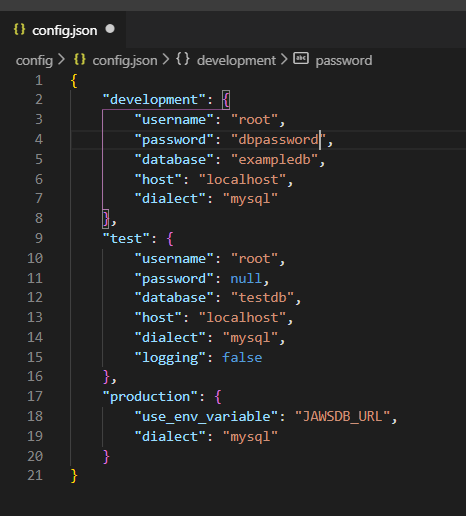

### config.json
This _config_ directory is home to the __config.json__ file.  This directory and file are created after running the command __npx sequelize init:config__. The __config.json__ file uses the _developments_ object to gain access to the SQL database, _test_ object to connect a database that holds the app's test code, and the _production_ object to connect a SQL reader for our deployed sight. 

## Models -> example.js, index.js, schema.sql
-----

### example.js

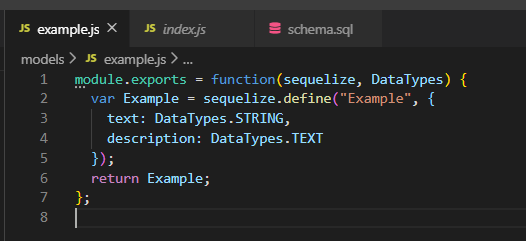

The Model directory holds all the files that will create our database for the application. The __example.js__ file is used to create a _Example_ model that matches up with the database. By calling _sequelize.define_ to create a table, within the _Example_ model, called "Example." The "Example" table has two properties _text_ which is a string value and _description_ which is a text value.

### index.js

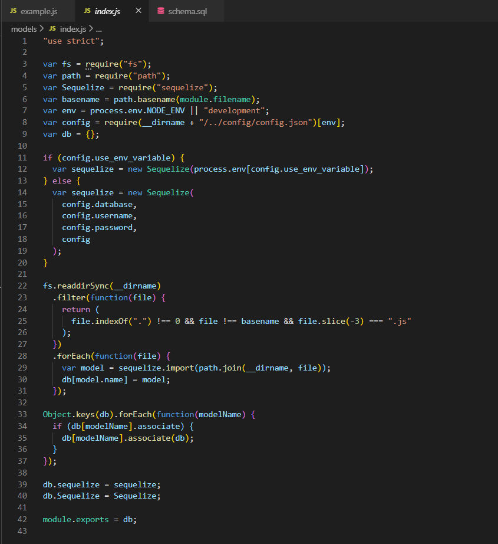

The index.js is created after running the command __npx sequelize init:models__. This index file creates our database using sequelize and exports it using the variable name _db_. We call this _db_ in our api routes.

### schema.sql

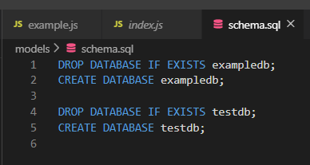

We use this _schema_ to create a database in our SQL program. 

## Public -> index.js, style.css
-----

### index.js part 1

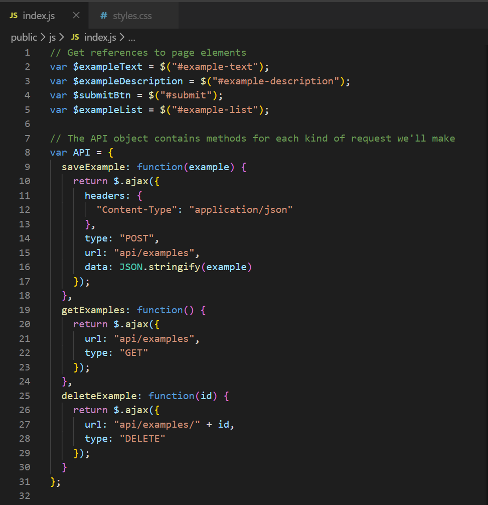

The __Public__ directory holds the View of our front-end JavaScrip. In this first screen shot we create a variable that holds functions that handle all the API calls. The _saveExample_ function handles our ajax POST request in order to save the example text into the database; The _getExample_ function handles our ajax GET request in order to display our examples from our database; The _deleteExample_ function handles our ajax DELETE request to remove example posts from our database. 

### index.js part 2

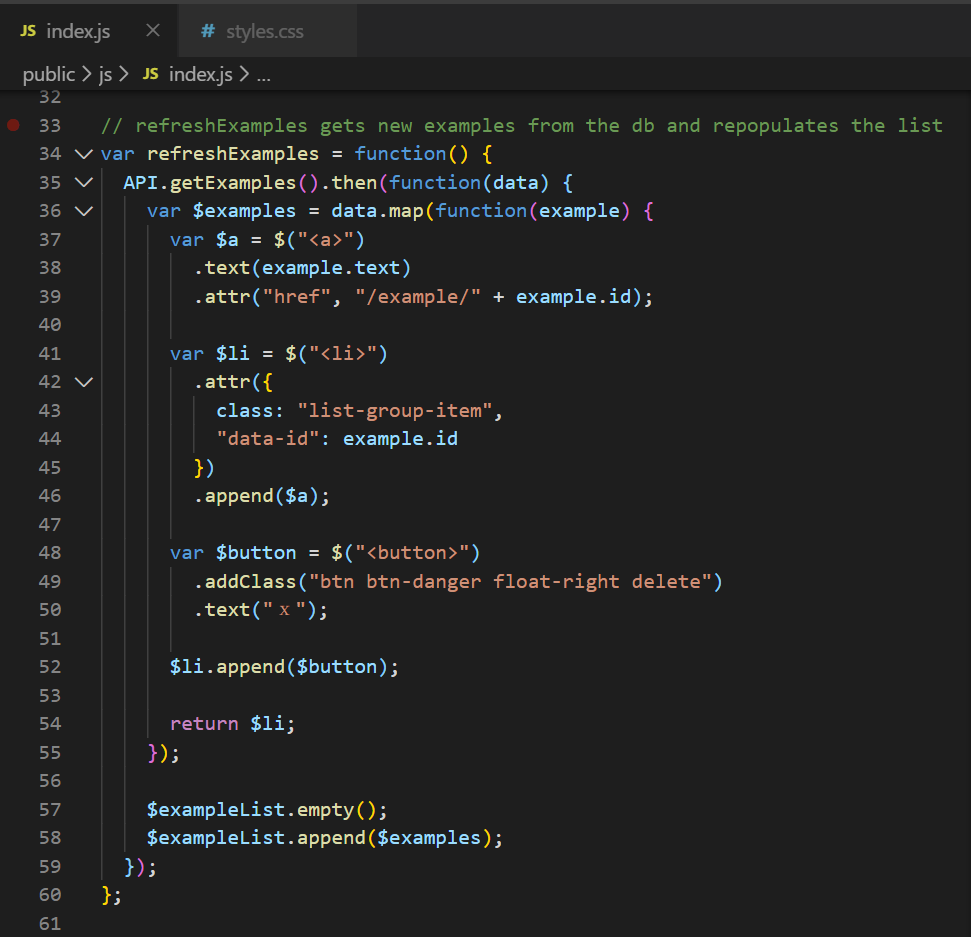

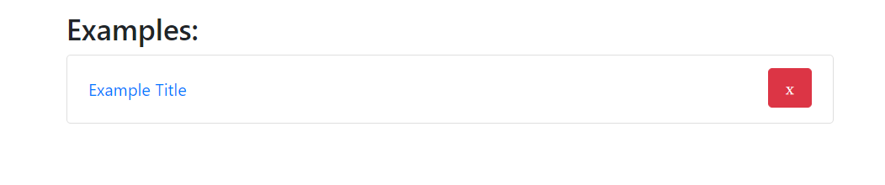

These lines of code dynamically creating HTML to hold our information from the database. The _"a"_ tag is created to hold the title of the blog post and is a link to the unique blog post information. The _"a"_ link is appended to the _"li"_ elements, and an delete _"button"_ is created and floated to the left.

### index.js part 3

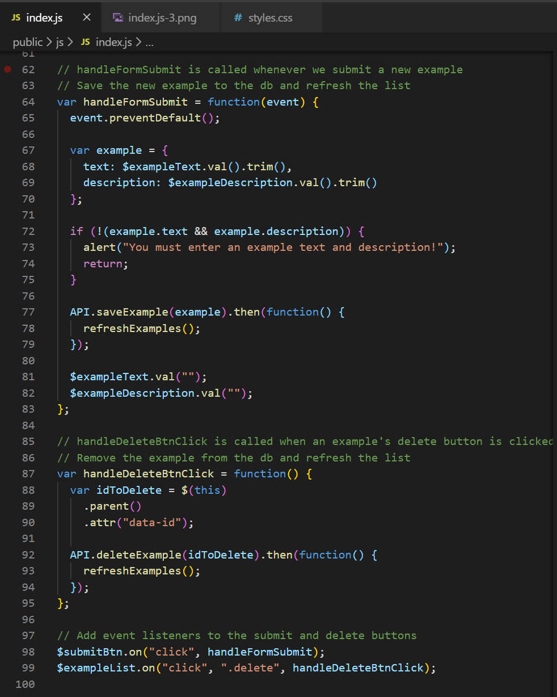

The last lines of code excutes the ajax calls defined earlier. Line 77 __API.saveExample__ takes the user input information, lines 68 and 69, from the form and saves it to the database. Afterwards the form resets it's values to a blank string. Line 87 runs a function that handles the DELETE function.

## Routes -> apiRoutes.js, htmlRoutes.js
-----

### apiRoutes.js

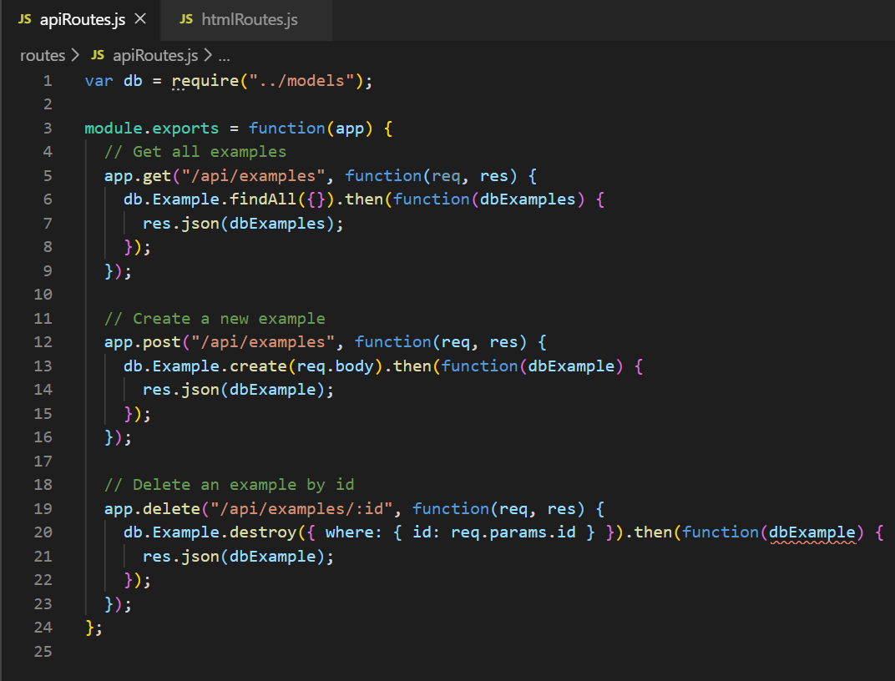

This javaScript file is the controller for the API calls. Each time a client makes a request the server responds with an action of either getting information, creating information, or deleting information.

### apiHTML.js

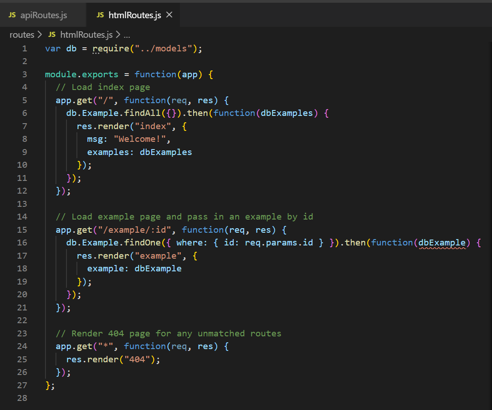

This javaScript file is the controller for the HTML calls. When the landing page ("/") loads it will GET and load the blog posts. When we click on the individual post it will GET the specific post information ("/example/:id"). 

## Tests -> canary.test.js
---

### canary.test.js

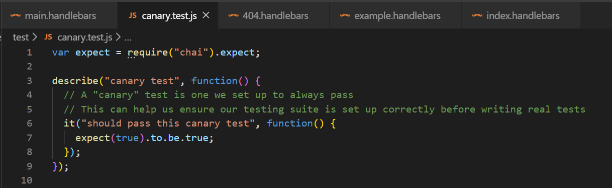

The Chai package is setting up a canary.test: a test that is designed to always pass. This test is used to check if the testing suite is set up correctly before adding application code test.

## Views -> main.handlebars, 404.handlebars, example.handlebars, index.handlebars
-----

### main.handlebars

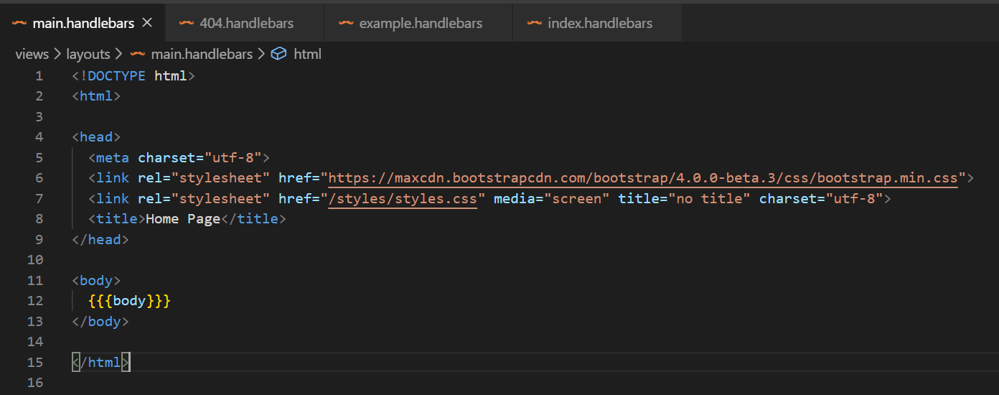

This `main.handlebars` file is using the handlebars package to generate the HTML template. The `{{body}}` is a replacment feature that will take in the `index.handlebars` file. 

### index.handlebars
-----
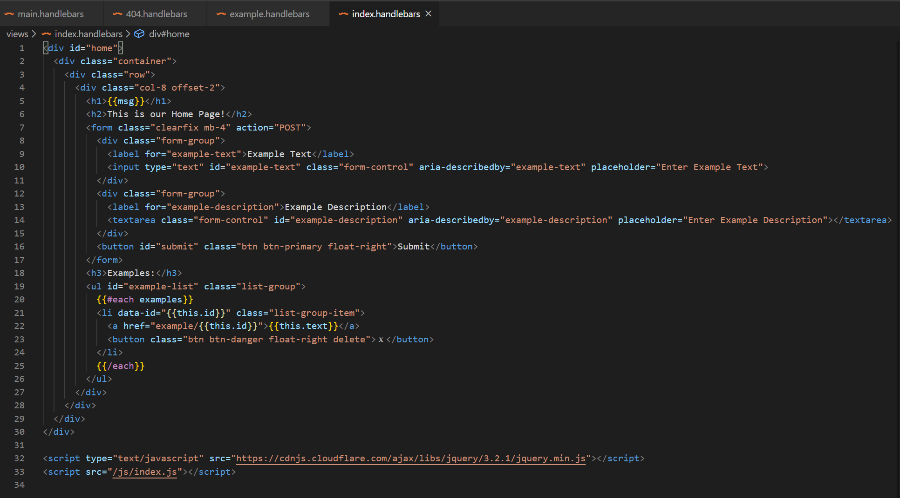

In `index.handlebars` there are multiple `{{variable}}` place holders. These place holders take in object properties made in our `js directory -> index.js file` and plugs it into this file. This is how the html elements are dynamically created using handlebars. 

## Root -> .eslintrc.json, .travis.yml, package.json, server.js
-----

### .eslintrc.json
---
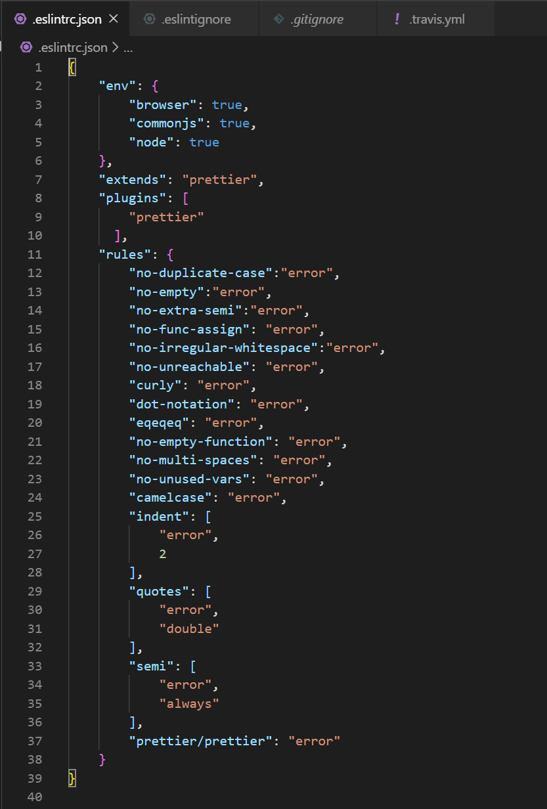

The `.eslintrc.json` file has a set of rules that display syntax errors wihtin the code. When __npx eslint {{name of file}} --help__ is ran in the terminal and the program will correct as many syntax errors as it can. 

### .travis.yml
---
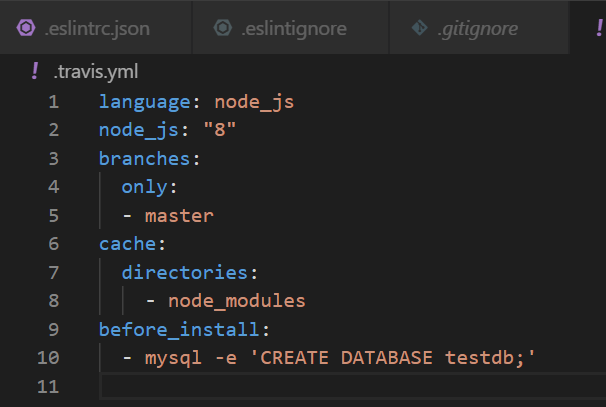

This travis file makes it so branch code cannot be merged into the master branch unless the branch code passes the linter. 

### server.js
---
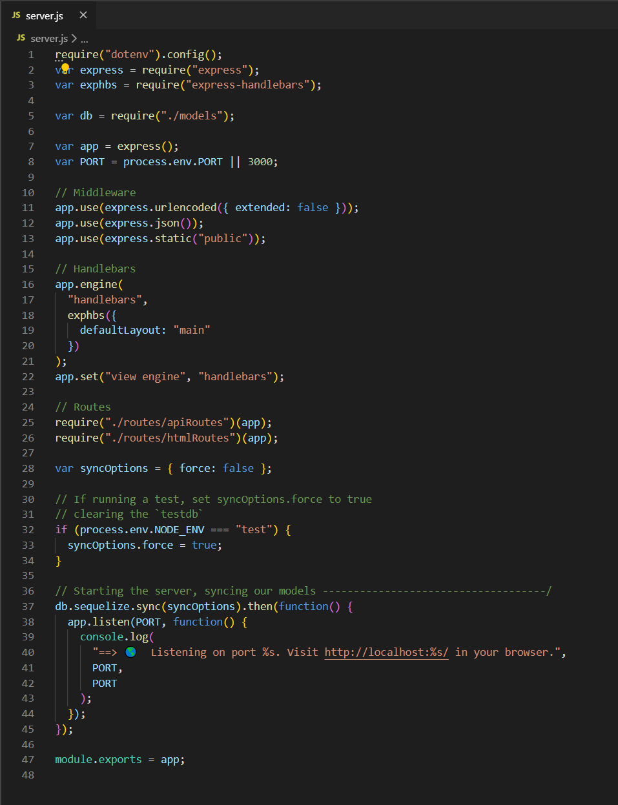

Our server is run by using the Express Library. This server creates a port for our server to listen on, runs middleware to parse our infrormation into JSON formate, handles our handlebars library, takes in our api and html routes, and finally syncs our database to our application.

